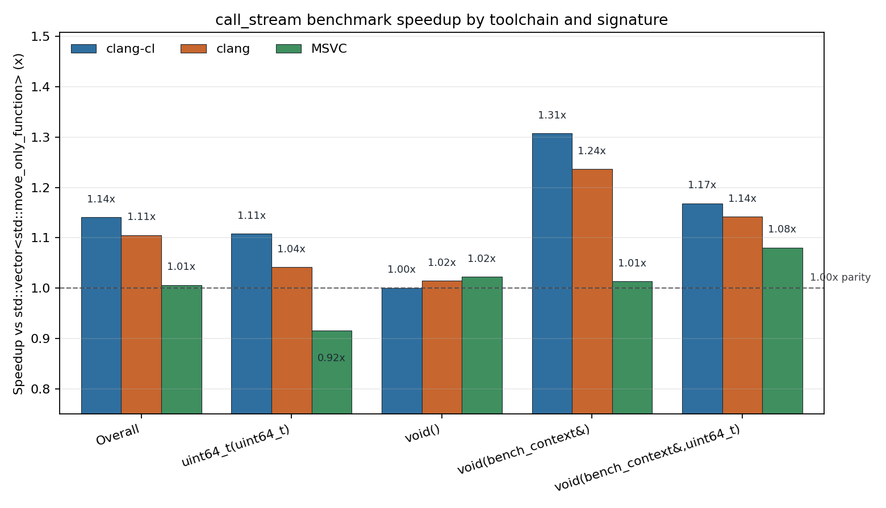

# call_stream

`call_stream` is a C++ module exporting `mo_yanxi.call_stream`. It stores a sequence of heterogeneous callables in one contiguous byte buffer and dispatches them in insertion order. The intended use case is a hot command queue that would otherwise be represented as `std::vector<std::move_only_function<...>>`.

It supports:

- `void()`, `void(Args...)`, and `Ret(Args...)` streams.
- Zero-payload dispatch for empty call objects or compatible static `operator()`.
- Inline storage for trivially copyable callables.
- Inline or heap-backed lifetime management for non-trivial callables.
- `reserve`, `clear`, `merge`, `reset_ip`, and early stop for result callbacks.
- A compile-time exception policy: resumable exceptions by default, or an opt-in
  `noexcept` stream that rejects potentially throwing callables.

## Example

```cpp
import mo_yanxi.call_stream;
import std;

mo_yanxi::call_stream<void(std::vector<int>&)> stream;

stream.emplace_back([](std::vector<int>& out) { out.push_back(1); });
stream.emplace_back([](std::vector<int>& out) { out.push_back(2); });

std::vector<int> values;
stream.execute(values);

stream.reset_ip();
stream.execute(values);
```

For return-value streams, the last `execute` argument is the result callback. A callback returning `true` stops dispatch; a callback returning `void` consumes all results.

```cpp
mo_yanxi::call_stream<std::uint64_t(std::uint64_t)> stream;

stream.emplace_back([](std::uint64_t x) { return x + 1; });
stream.emplace_back([](std::uint64_t x) { return x + 2; });

std::uint64_t sum = 0;
stream.execute(10, [&](std::uint64_t result) {
    sum += result;
});
```

## Exception Policy

`call_stream<FnSign>` uses `call_stream_exception_policy::resumable` by default.
If a stored callable throws during `execute`, the stream keeps `current_ip()` at
that callable. A later `execute` resumes from the same instruction instead of
restarting from the beginning or skipping to the end.

Use `noexcept_call_stream<FnSign>` or the third `call_stream` template argument
to require nothrow execution:

```cpp
mo_yanxi::noexcept_call_stream<void()> stream;
// Equivalent:
mo_yanxi::call_stream<
    void(),
    std::allocator<std::byte>,
    mo_yanxi::call_stream_exception_policy::nothrow> stream2;
```

In `nothrow` mode, `emplace_back`, `push_back`, and `operator<<` only accept
callables that are `std::is_nothrow_invocable_r_v` for the stream signature.
Return-value callbacks passed to `execute` must also be nothrow. This keeps the
hot dispatch path free of exception recovery state. `nothrow` streams use
noexcept invoker function pointers and compile-time dispatch branches; tail
dispatch can be enabled with `MO_YANXI_CALL_STREAM_USE_NOEXCEPT_TAIL_DISPATCH`
on compiler/configuration combinations that accept the musttail trampoline.

## Build And Test

The project uses xmake and depends on `gtest` and `benchmark`.

```powershell
xmake f -c -p windows -a x64 -m release --host_project=y --toolchain=msvc -o build\msvc -y
xmake -r -y call_stream.test
.\build\msvc\windows\x64\release\call_stream.test.exe

xmake f -c -p windows -a x64 -m release --host_project=y --toolchain=clang-cl -o build\clang-cl -y
xmake -r -y call_stream.test
.\build\clang-cl\windows\x64\release\call_stream.test.exe
```

The benchmark helper runs the same release/fastest configuration for clang-cl, clang, and MSVC, cleans C++ module build artifacts between targets, runs correctness tests, runs Google Benchmark, and writes a parsed Markdown summary plus a PNG bar chart:

```powershell
python profiling\run_benchmarks.py --min-time 0.12 run
```

To regenerate only the Markdown summary and chart from existing JSON files:

```powershell
python profiling\run_benchmarks.py --min-time 0.12 --repetitions 3 summarize
```

## Benchmark

The benchmark compares `call_stream` against `std::vector<std::move_only_function<...>>` across 4 signatures, 5 workloads, and 64/1024 call counts. Speedup is vector CPU time divided by `call_stream` CPU time.




Final run, 2026-05-30:

| Toolchain | Faster cases | Geomean | `void()` | `void(bench_context&)` | `void(bench_context&,uint64_t)` | `uint64_t(uint64_t)` |
| --- | ---: | ---: | ---: | ---: | ---: | ---: |
| clang-cl | 25/40 | 1.14x | 1.00x | 1.31x | 1.17x | 1.11x |
| clang | 24/40 | 1.11x | 1.02x | 1.24x | 1.14x | 1.04x |
| MSVC | 17/40 | 1.01x | 1.02x | 1.01x | 1.08x | 0.92x |

Environment:

- Date: 2026-05-30
- CPU: 13th Gen Intel(R) Core(TM) i9-13900HX, 24 cores / 32 threads
- OS: Windows 11
- Google Benchmark: v1.9.5 release
- Build: xmake release, `fastest`, `/DNDEBUG`, `/MD`, `/std:c++latest`, AVX/AVX2 enabled

## Profiling

VTune profiling is scripted separately from Google Benchmark so the sampled target contains only the selected workload loop:

```powershell
xmake f -c -p windows -a x64 -m release --host_project=y --toolchain=clang-cl -o build\clang-cl -y
xmake -r -y call_stream.profile
python profiling\run_vtune_profiles.py run --target build\clang-cl\windows\x64\release\call_stream.profile.exe --preset focused --seconds 3 --calls 1024 --batch 8192 --force
```

Current hotspot reports are under [profiling/results](profiling/results), with the parsed summary at [profiling/results/analysis.md](profiling/results/analysis.md).

## Performance Notes

The strongest wins are short command streams with reference context arguments, especially under clang-cl where tail dispatch is active. Heavy workloads are often limited by the payload computation itself, so dispatch differences shrink.

The latest optimization pass removed per-result state writes for trivially destructible return values and bypassed `std::invoke` for ordinary directly callable objects. That moved the clang-cl `uint64_t(uint64_t)` group from a weak path to a modest win overall, while MSVC remains close to parity.
