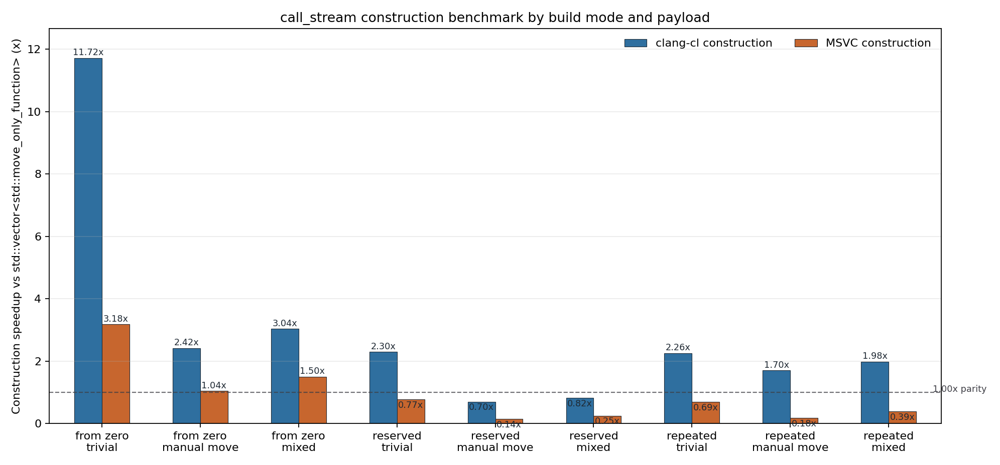
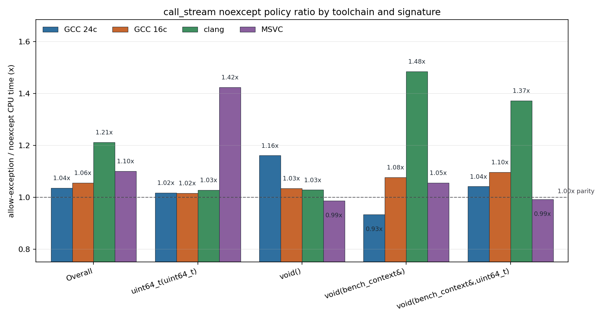

# call_stream

`call_stream` is a C++ module exporting `mo_yanxi.call_stream`. It stores a sequence of heterogeneous callables in one contiguous byte buffer and dispatches them in insertion order. The intended use case is a hot command queue that would otherwise be represented as `std::vector<std::move_only_function<...>>`.

It supports:

- `void()`, `void(Args...)`, and `Ret(Args...)` streams.
- Zero-payload dispatch for empty call objects or compatible static `operator()`.
- Inline storage for trivially copyable callables.
- Inline or heap-backed lifetime management for non-trivial callables.
- `reserve`, `clear`, `merge`, `reset_ip`, `continue_execute`,
  `reset_and_execute`, `operator()`, IP state queries, and early stop for
  result callbacks.
- A compile-time exception policy: resumable exceptions by default, or an opt-in
  `noexcept` stream that rejects potentially throwing callables.

## Example

```cpp
import mo_yanxi.call_stream;
import std;

mo_yanxi::call_stream<void(std::vector<int>&)> stream;

stream.emplace_back([](std::vector<int>& out) { out.push_back(1); });
stream.emplace_back([](std::vector<int>& out) { out.push_back(2); });

std::vector<int> values;
stream(values); // operator() resets ip, then executes from the beginning.

stream.reset_and_execute(values);

if(stream.is_finished()) {
    stream.reset_ip();
}
```

For return-value streams, the last `reset_and_execute`, `continue_execute`, or
`operator()` argument is the result callback. A callback returning `true` stops
dispatch; a callback returning `void` consumes all results.

```cpp
mo_yanxi::call_stream<std::uint64_t(std::uint64_t)> stream;

stream.emplace_back([](std::uint64_t x) { return x + 1; });
stream.emplace_back([](std::uint64_t x) { return x + 2; });

std::uint64_t sum = 0;
stream(10, [&](std::uint64_t result) {
    sum += result;
});
```

`continue_execute` starts from the current instruction pointer. Use it to resume
after a partial run, and use `reset_and_execute` or `operator()` when every call
should run from the beginning:

```cpp
if(stream.has_pending_instructions()) {
    stream.continue_execute(10, [&](std::uint64_t result) {
        sum += result;
    });
}
```

## Exception Policy

`call_stream<FnSign>` infers its exception policy from `FnSign`: ordinary
function signatures use `call_stream_exception_policy::resumable`, while
`noexcept` function signatures use `call_stream_exception_policy::nothrow`.
If a stored callable throws during `continue_execute` or `reset_and_execute`,
the stream keeps `current_ip()` at that callable. A later `continue_execute`
resumes from the same instruction, while `reset_and_execute` and `operator()`
restart from the beginning. `is_at_start()`, `is_finished()`,
`is_partially_executed()`, and `has_pending_instructions()` expose the current
IP state.

Add `noexcept` to the function signature to require nothrow execution:

```cpp
mo_yanxi::call_stream<void() noexcept> stream;
```

`noexcept_call_stream<FnSign>` and the explicit third `call_stream` template
argument remain available when an existing call site wants to spell the policy
directly.

In `nothrow` mode, `emplace_back`, `push_back`, and `operator<<` only accept
callables that are `std::is_nothrow_invocable_r_v` for the stream signature.
Return-value callbacks passed to `continue_execute`, `reset_and_execute`, or
`operator()` must also be nothrow. This keeps the
hot dispatch path free of exception recovery state. `nothrow` streams use
noexcept invoker function pointers and compile-time dispatch branches. For
`void`-returning streams, clang builds enable the musttail trampoline by
default when `[[clang::musttail]]` is available, including resumable streams
whose callables may throw. Resumable tail dispatch records the current
instruction in shared dispatch state before each payload call, so exceptions
still resume at the failing instruction. Define
`MO_YANXI_CALL_STREAM_USE_NOEXCEPT_TAIL_DISPATCH=0` to force loop dispatch for
that path.

## Build And Test

The project uses xmake and depends on `gtest` and `benchmark`.

```powershell
xmake f -c -p windows -a x64 -m release --host_project=y --toolchain=msvc -o build\msvc -y
xmake -r -y call_stream.test
.\build\msvc\windows\x64\release\call_stream.test.exe

xmake f -c -p windows -a x64 -m release --host_project=y --toolchain=clang-cl -o build\clang-cl -y
xmake -r -y call_stream.test
.\build\clang-cl\windows\x64\release\call_stream.test.exe
```

The benchmark helper runs the selected release/fastest toolchains, cleans C++
module build artifacts between targets, runs correctness tests, runs Google
Benchmark, and writes a parsed Markdown summary plus PNG charts:

```powershell
python profiling\run_benchmarks.py --toolchain clang --toolchain msvc --min-time 0.12 --repetitions 7 --force-dispatch-macros run
```

To regenerate only the Markdown summary and charts from existing JSON/text
result files:

```powershell
python profiling\run_benchmarks.py --source "GCC 24c=benchmark_results/gcc_linux_24cpu_force_dispatch.txt" --source "GCC 16c=benchmark_results/gcc_linux_16cpu_force_dispatch.txt" --toolchain clang --toolchain msvc --min-time 0.12 --repetitions 7 --force-dispatch-macros summarize
```

## Benchmark

The benchmark compares `call_stream` against `std::vector<std::move_only_function<...>>` across 4 signatures, 5 workloads, and 64/1024 call counts. Speedup is vector CPU time divided by `call_stream` CPU time.


Current forced-dispatch run, 2026-06-15:

| Data source | Faster cases | Geomean | `void()` | `void(bench_context&)` | `void(bench_context&,uint64_t)` | `uint64_t(uint64_t)` |
| --- | ---: | ---: | ---: | ---: | ---: | ---: |
| GCC 24c text | 24/40 | 1.16x | 1.45x | 0.98x | 1.26x | 0.99x |
| GCC 16c text | 19/40 | 1.01x | 1.02x | 1.11x | 1.09x | 0.85x |
| clang | 29/40 | 1.12x | 1.04x | 1.27x | 1.16x | 1.04x |
| MSVC | 18/40 | 0.96x | 0.98x | 0.98x | 0.99x | 0.90x |

Environment and inputs:

- Date: 2026-06-15
- Imported GCC raw text: [gcc_linux_24cpu_force_dispatch.txt](benchmark_results/gcc_linux_24cpu_force_dispatch.txt), [gcc_linux_16cpu_force_dispatch.txt](benchmark_results/gcc_linux_16cpu_force_dispatch.txt)
- GCC import notes: [gcc_force_dispatch_sources.md](benchmark_results/gcc_force_dispatch_sources.md)
- Local clang/MSVC host: Windows 11 10.0.26200, Intel64 Family 6 Model 183 Stepping 1, 32 logical CPUs
- Google Benchmark: v1.9.5 release
- Local build: xmake release, `fastest`, `/DNDEBUG`, `/MD`, `/std:c++latest`, AVX/AVX2 enabled
- Local benchmark parameters: `--benchmark_min_time=0.12s`, `--benchmark_repetitions=7`, aggregate mean rows
- Forced local dispatch macros: `MO_YANXI_CALL_STREAM_USE_TAIL_DISPATCH=1`, `MO_YANXI_CALL_STREAM_USE_SCALAR_RESULT_DISPATCH=1`

`MO_YANXI_CALL_STREAM_FORCE_INLINE` is compiler-selected by the module source.
MSVC was tested with the forced dispatch request and passed correctness plus the
full benchmark, but the current source still keeps
`MO_YANXI_CALL_STREAM_HAS_TAIL_DISPATCH=0` for MSVC, so this does not benchmark
an unsafe MSVC musttail path.

Detailed per-workload rows are in [benchmark_results/summary.md](benchmark_results/summary.md).

### Construction Benchmark

The construction benchmark times building equivalent `call_stream<void() noexcept>`
and `std::vector<std::move_only_function<void()>>` sequences. Construction
cases use Google Benchmark manual timing: each reported iteration batches 64
container builds and records only the construct/reserve/append window. Each
built sequence is executed after the manual timer stops so the payload writes
must be materialized; execution, destruction, and `clear()` are excluded from
the measured construction time.

Build modes:

- `from zero`: construct a fresh empty container without reserve.
- `reserved`: construct a fresh empty container, then reserve capacity before
  appending. `call_stream` reserves byte capacity; vector reserves element
  capacity.
- `repeated`: warm the container once, clear it, then time rebuilds that reuse
  retained capacity.

Payload sets:

- `trivial`: non-empty trivially copyable call objects.
- `manual move`: move-only call objects with a handwritten `noexcept` move
  constructor.
- `mixed`: alternating trivial and manual-move call objects.



Current local construction run, 2026-06-15. Speedup is vector construction time
divided by `call_stream` construction time; values above `1.00x` mean
`call_stream` builds faster. Table values are geomeans across 64 and 1024 calls.

| Build mode | Payload | clang-cl | MSVC |
| --- | --- | ---: | ---: |
| from zero | trivial | 11.72x | 3.18x |
| from zero | manual move | 2.42x | 1.04x |
| from zero | mixed | 3.04x | 1.50x |
| reserved | trivial | 2.30x | 0.77x |
| reserved | manual move | 0.70x | 0.14x |
| reserved | mixed | 0.82x | 0.25x |
| repeated | trivial | 2.26x | 0.69x |
| repeated | manual move | 1.70x | 0.18x |
| repeated | mixed | 1.98x | 0.39x |
| overall | all | 2.12x | 0.58x |

Construction benchmark inputs:

- Raw clang-cl data: [clangcl_construction.json](benchmark_results/clangcl_construction.json), [clangcl_construction.txt](benchmark_results/clangcl_construction.txt)
- Raw MSVC data: [msvc_construction.json](benchmark_results/msvc_construction.json), [msvc_construction.txt](benchmark_results/msvc_construction.txt)
- Local benchmark parameters: `--benchmark_filter=construction`, `--benchmark_min_time=0.001s`, `--benchmark_repetitions=3`, aggregate mean rows

The first construction draft used `PauseTiming()`/`ResumeTiming()` once per
measured iteration to exclude validation execution. That polluted the fast
construction cases and made clang-cl look much slower than MSVC. Verbose xmake
builds showed matching release settings (`/MD`, `O2`, AVX/AVX2, `DNDEBUG`,
PDBs, `/opt:ref`, `/opt:icf`), so the anomaly was not explained by missing
clang-cl optimization flags. After switching to batched manual timing,
`call_stream` construction is faster under clang-cl in all 18 construction
rows. The remaining clang-cl overhead is on the vector side: VTune on
`construct_vector_from_zero_trivial_1024` reports
`std::vector<std::move_only_function<void()>>::emplace_back` as the dominant
hotspot, with allocator time secondary. The matching `call_stream` profile is
dominated by `emit_instruction`, buffer allocation, and the one-shot validation
execution.

### Exception Policy Benchmark

The benchmark binary also registers `call_stream_allow_exception/...` cases to compare the default resumable exception policy against the matching `noexcept` stream. Both sides use the same nothrow payload callables; the ratio is allow-exception CPU time divided by `noexcept` CPU time, so values above `1.00x` mean the `noexcept` policy is faster.



| Data source | `noexcept` faster cases | Geomean ratio | `void()` | `void(bench_context&)` | `void(bench_context&,uint64_t)` | `uint64_t(uint64_t)` |
| --- | ---: | ---: | ---: | ---: | ---: | ---: |
| GCC 24c text | 27/40 | 1.04x | 1.16x | 0.93x | 1.04x | 1.02x |
| GCC 16c text | 28/40 | 1.06x | 1.03x | 1.08x | 1.10x | 1.02x |
| clang | 35/40 | 1.21x | 1.03x | 1.48x | 1.37x | 1.03x |
| MSVC | 23/40 | 1.10x | 0.99x | 1.05x | 0.99x | 1.42x |

## Profiling

VTune profiling is scripted separately from Google Benchmark so the sampled target contains only the selected workload loop:

```powershell
xmake f -c -p windows -a x64 -m release --host_project=y --toolchain=clang-cl -o build\clang-cl -y
xmake -r -y call_stream.profile
python profiling\run_vtune_profiles.py run --target build\clang-cl\windows\x64\release\call_stream.profile.exe --preset focused --seconds 3 --calls 1024 --batch 8192 --force
```

Current hotspot reports are under [profiling/results](profiling/results), with the parsed summary at [profiling/results/analysis.md](profiling/results/analysis.md).

## Performance Notes

The strongest current local result is clang: `call_stream` wins 29/40 vector
cases with a 1.12x geomean speedup, mainly from context-bearing signatures.
MSVC is slightly below parity overall at 0.96x even with scalar result dispatch
forced on; the MSVC musttail path remains guarded off for stack safety.

The two imported GCC runs disagree in shape: one shows a 1.16x geomean win and
the other is near parity at 1.01x. Treat them as separate Linux/GCC data points,
not repeated measurements of the same host. Both raw files also warn that CPU
scaling and ASLR were enabled.

Heavy payload workloads remain close to parity because payload computation
dominates dispatch. The `noexcept` policy still helps most clearly under clang
for context-bearing void signatures, while MSVC's largest policy win appears in
the scalar return signature.
